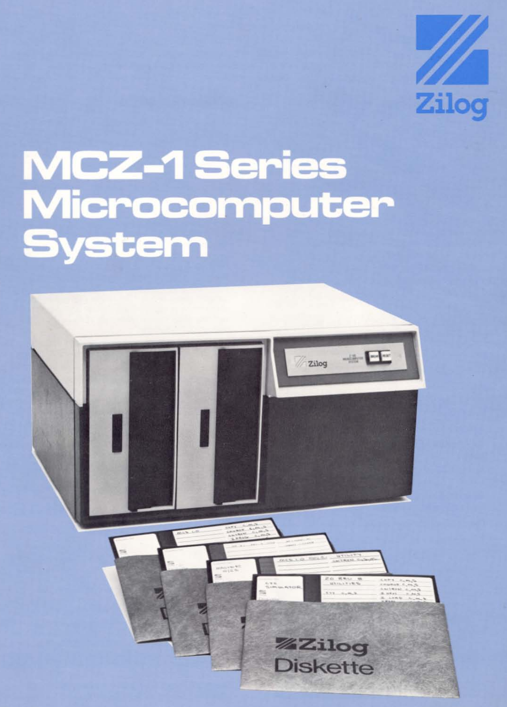

# MCZ-1 Emulator

## What is this?

This is an emulator of the MCZ-1 computer by Zilog used for Z80 development. This is not a high fidelity emulator, I have no access to the real devices. The objective is being able to run the MCZ-1 monitor and the RIO operating system. The floppy controller is simulated not emulated, by capturing the floppy call on the PROM.

It uses the [iz80](https://github.com/ivanizag/iz80) library. Made with Rust, for Linux and Windows.

## What was a MCZ-1 computer?

The MCZ-1 is a computer from Zilog to support the creation of new systems using their Z80 processor. It could run the RIO operating system. Other computers of the same family were the ZDS and PDS models. The basic configuration has an [MCB](https://github.com/sebhc/sebhc/blob/master/mcz/docs/03-0007-03_Z80-MCB_Hardware_Users_Manual.pdf) Microcomputer Board and a [MDC](https://github.com/sebhc/sebhc/blob/master/mcz/docs/03-3006-02_Z-80_MDC_Hardware_Reference_Manual.pdf) Memory Disk Controller board.

Main features:

- Z80 processor
- 3Kb of [PROM](http://bitsavers.trailing-edge.com/pdf/zilog/mcz-1/firmware/ZilogPDS_3K_ROM_SOURCE.zip) with I/O, floppy and debug drivers.
- 61kb of RAM
- Dual floppy 8-inch hard sectored discs. Single sided, 32 sectors, 77 tracks, 128+8 Bytes per sector.
- 1 RS232 port. Emulated with the host console.
- 2 parallet ports. Not emulated.
- 9 slots

From the Zilog [brochure](https://web.archive.org/web/20170904130919/https://amaus.org/static/S100/zilog/brochure/Zilog%20MCZ-1%20Series%20System.pdf): The Zilog MCZ-1 Microcomputer Systems are a series of general purpose computers providing very high performance at a low cost. These systems are designed for high reliability and low maintenance. The MCZ-1 Systems
feature the use of the Z80 Microprocessor and its 158 instruction set, a disk based operating system, main storage capacity for up to 65K bytes of semiconductor memory, and two integral floppy disk drives. The MCZ-1
Series consists of units that are free standing, rack mountable and expandable beyond the basic 9 slot card cage
that is provided as part of the standard MCZ-1 Microcomputer.



## Usage examples

### Monitor

The MCZ-1 boots to the [monitor](http://bitsavers.trailing-edge.com/pdf/zilog/mcz-1/03-3106-01A_MCZ-1_20A_and_MCZ-1_25A_Microcomputers_Floppy_Prom_User_Guide_Dec79.pdf). Run the emulator and press any key, not an enter, to get the monitor prompt. Exit the emulator with control C.

```
casa@servidor:~$ ./izilogmcz
Emulation of the Zilog MCZ-1 computer
https://github.com/ivanizag/izilogmcz

>REG
A  B  C  D  E  F  H  L  I  A' B' C' D' E' F' H' L'  IX   IY   PC   SP  
FF 00 00 00 00 FF 00 00 00 00 00 00 00 00 00 00 00 0000 0000 0000 FFFF 
>DUMP 0B34 40
0B34 53 45 52 49 41 4C 20 50 4F 52 54 20 49 4E 50 55 *SERIAL PORT INPU*
0B44 54 20 0D 09 42 52 45 41 4B 20 41 54 20 0B 44 49 *T ..BREAK AT .DI*
0B54 53 4B 20 45 52 52 4F 52 0D 60 40 2C 24 20 18 10 *SK ERROR.`@,$ ..*
0B64 08 04 02 01 04 02 01 03 11 00 01 3E 7F 08 00 00 *...........>....*
>DUMP 3000 10
3000 00 00 00 00 00 00 00 00 00 00 00 00 00 00 00 00 *................*
>SET 3000 01 02 03 04 05 06 07
>DUMP 3000 10
3000 01 02 03 04 05 06 07 00 00 00 00 00 00 00 00 00 *................*
>MOVE 3008 3000 8
>DUMP 3000 10
3000 01 02 03 04 05 06 07 00 01 02 03 04 05 06 07 00 *................*
>COMPARE 3000 3008 8
>FILL 3008 300F 8
>DUMP 3000 10
3000 01 02 03 04 05 06 07 00 08 08 08 08 08 08 08 08 *................*
>COMPARE 3000 3008 8
3000=01 3008=08 
3001=02 3009=08 
3002=03 300A=08 
3003=04 300B=08 
3004=05 300C=08 
3005=06 300D=08 
3006=07 300E=08 
3007=00 300F=08 
```

### Load Zilog RIO

If no images are provided on the command line, the OS 2.2 is used. Load the OS with a double return on boot or with the OS command in the monitor:
```
casa@servidor:~$ ./izilogmcz 
Emulation of the Zilog MCZ-1 computer
https://github.com/ivanizag/izilogmcz

>OS
FRIDAY, SEPTEMBER  1, 1978
RIO REL 2.2
%DISPLAY
DISPLAY
                    MEMORY ALLOCATION MAP

            0        400       800       C00
            |   |     |   |     |   |     |   |
0000        AAAAAAAA  AAAAAAAA  AAAAAAAA  AAAAAAAA
1000        AAAAAAAA  AAAAAAAA  AAAAAAAA  AAAAAAAA
2000        AAAAAAAA  AAAAAAAA  AAA.AAAA  AAAAAAAA
3000        AAAAAAAA  AAAAAAAA  AAAAAAAA  AAAAAAAA
4000        AAAAAAAA  AAAAA...  ........  ........
5000        ........  ........  ........  ........
6000        ........  ........  ........  ........
7000        ........  ........  ........  ........
8000        ........  ........  ........  ........
9000        ........  ........  ........  ........
A000        ........  ........  ........  ........
B000        ........  ........  ........  ........
C000        ........  ........  ........  ........
D000        ........  ........  ........  ........
E000        ........  ........  ........  ........
F000        ........  ........  ....AAAA  AAAAAAAA

        "." => FREE    "A" => ALLOCATED
%STATUS
STATUS

DRIVE 0   13-3001-03 MCZ RIO 2.2
1904 SECTORS USED
 560 SECTORS AVAILABLE

DRIVE 1   EMPTY
1224 SECTORS USED
1240 SECTORS AVAILABLE

DRIVE 2   13-3001-01A MCZ1/20 RIO
1769 SECTORS USED
 695 SECTORS AVAILABLE

DRIVE 3   SYS20DEC82 DRIVE 0
2426 SECTORS USED
  38 SECTORS AVAILABLE
%CAT D=0
CAT D=0
 FILENAME         DRIVE
 OS.INIT            0    
 MCZ.1.20.RIO.OBJ   0    
 LAST_MODULE.OBJ    0    
 ECHO.OBJ           0    
 MCZ.1.20.PROM.780808.OBJ        
                    0    
 MCZ.ZDOS.OBJ       0    
 CON.MAIN.OBJ       0    
 CON.MCZ.OBJ        0    
 DO.OBJ             0    
 PAUSE.OBJ          0    
 IMAGE.OBJ          0    
 RELINK.MCZ.COMMAND 0    
 NBUG.OBJ           0    
 NBUG1.OBJ          0    
 NBUG2.OBJ          0    
 NBUGLAST.OBJ       0    
 NBUG.LINK.CMD      0    
 ZBUG.OBJ           0    
 NOTE.TO.RIO.USER   0    
 PRINTER_DEMONSTRATION           
                    0    
 PRINTER            0    
 PRINTER.OBJ        0    
 PRINTER.S          0    
%DATE
DATE
FRIDAY, SEPTEMBER  1, 1978
%
```

### Use ZDS file images

Up to 8 disk images can be provided from the command line. The ZDS images must have 335104 bytes.

```
casa@servidor:~$ izilogmcz 13-3001-01_MCZ1-20_RIO_206.MCZ EMPTY.MCZ 13-3001-03_MCZ-PDS_RIO_220-MCZIMAGER.MCZ 
Emulation of the Zilog MCZ-1 computer
https://github.com/ivanizag/izilogmcz

>
RIO REL 2.06
%STATUS

DRIVE 0   13-3001-01A MCZ1/20 RIO
1769 SECTORS USED
 695 SECTORS AVAILABLE

DRIVE 1   EMPTY
1224 SECTORS USED
1240 SECTORS AVAILABLE

DRIVE 2   13-3001-03 MCZ RIO 2.2
2241 SECTORS USED
 223 SECTORS AVAILABLE
%

```

## Documentation

- [Brochure MCZ-1 Series Microcomputer System](https://web.archive.org/web/20170904130919/https://amaus.org/static/S100/zilog/brochure/Zilog%20MCZ-1%20Series%20System.pdf)
- [MCZ-1/2A and MCZ-1/25A Microcomputers Floppy PROM User Guide](http://bitsavers.trailing-edge.com/pdf/zilog/mcz-1/03-3106-01A_MCZ-1_20A_and_MCZ-1_25A_Microcomputers_Floppy_Prom_User_Guide_Dec79.pdf)
- [Z80-MCB Hardware User's Manual](https://github.com/sebhc/sebhc/blob/master/mcz/docs/03-0007-03_Z80-MCB_Hardware_Users_Manual.pdf)
- [Z80-RIO Operating System User's Manual](http://bitsavers.trailing-edge.com/pdf/zilog/mcz-1/03-0072-01A_Z80-RIO_Operating_System_Users_Manual_upd_Nov79.pdf)
- Disks retrieved from: https://github.com/sebhc/sebhc/

## References

- https://rio.early8bitz.de/index.htm
- http://www.retrotechnology.com/restore/zilog.html
- https://github.com/sebhc/sebhc/blob/master/mcz/readme.md
- http://bitsavers.trailing-edge.com/pdf/zilog/mcz-1/
- https://oldcomputers.dyndns.org/public/pub/rechner/zilog/zds/manuals/
- http://www.computinghistory.org.uk/det/12157/Zilog-Z-80-Microcomputer-System/
- https://web.archive.org/web/20170903195837/https://amaus.org/static/S100/zilog/


